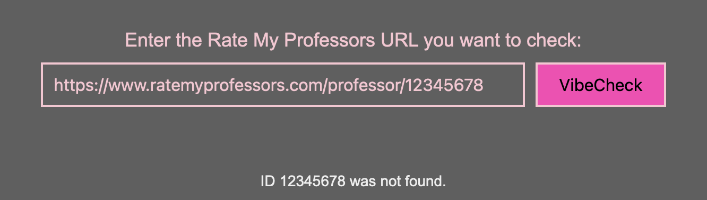
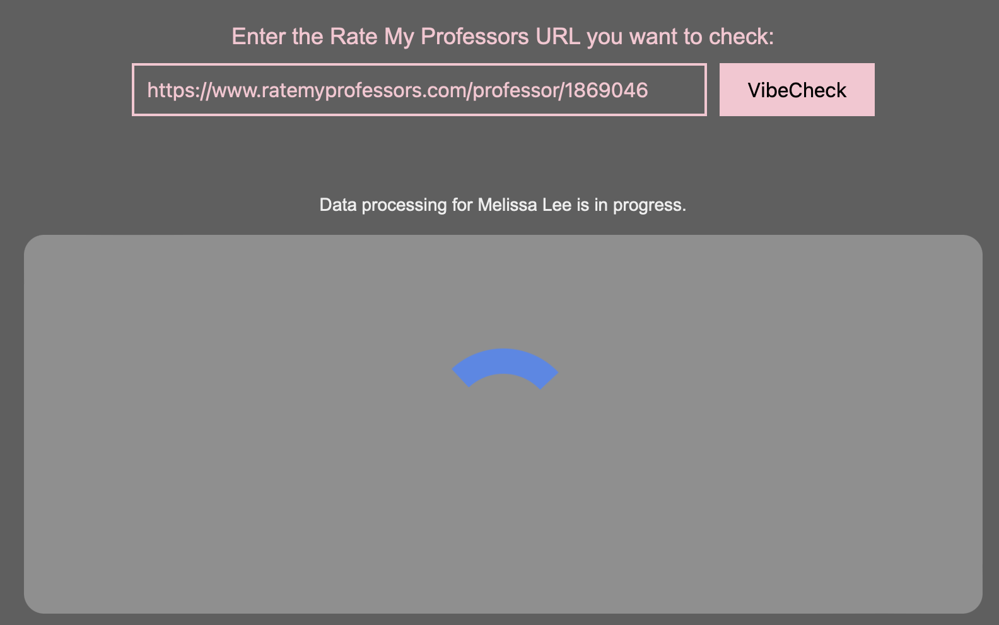
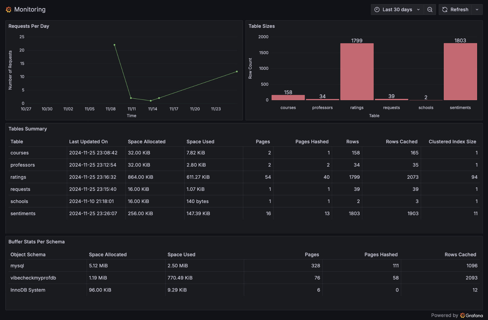

<h2 align="center">VibeCheckMyProf Guide</h2>

Welcome to the visual guide for the VibeCheckMyProf web application. This guide is designed to help you navigate the different components of our final project, ensuring you can effectively use it. 

If you encounter any problems with these steps to navigate the application, reach out to `Sadia` with questions. 

## WebPage Overview

- Upon loading VibeCheckMyProf, you arrive at the main interface. The title is displayed at the top, followed by a URL entry box where you can input a RateMyProfessors URL. Below that, there is a definitions box which provides explanations for the key terms helping you interpret the sentiment and ratings data. Finally, at the bottom of the page, there is a button that is linked to the data visualizations dashboard.

 

## 1. Entering A rateyprofessors URL

- To begin, paste the RateMyProfessors URL of the professor into the text box and click the "VibeCheck" button on the right to submit your request. 

- Ensure the URL is in the correct format, and is a valid link, to avoid errors. If the link is incorrect, you will see an error message.

- If the link has an ID which doesn't exist on RateMyProfessors, a message will be displayed letting you know that the ID was not found.

- Once the button is clicked, if the URL has not been entered before, data will not yet exist in the database. The application will need some time to process the sentiment analysis. Therefore, a status message will be displayed to let you know your request is in process. 

- After some time, another message will let you know the data processing is still in progress.

- After a couple of minutes (for new data), or immediately after (for existing data), the professor's results will be displayed on the page. 

 

## 2. Viewing A Professor's Data

- Once the data has loaded, you will see an overview of the professor's reviews in a black rectangle, along with individual course specific reviews, with ratings on RateMyProfessors, displayed in a pink rectangle. 

- For example, consider Professor Cinda Heeren from the University of British Columbia. Her reviews can be found at https://www.ratemyprofessors.com/professor/2302527

- After the data is loaded, the professor's name is displayed in the black rectangle along with the top three emotions found in the reviews. Below that, the 'Feels' section shows the sentiments associated with each review, and the number indicates how many reviews contain that sentiment. The quality and difficulty ratings are averaged from the ratings available on RateMyProfessors. Lastly, the 'Reviews' section displays the Positivity and Subjectivity scores from the sentiment results, as well as the average percentage of words spelled correctly in the review comments.

- Below that, you can view the course-specific reviews. A drop-down menu will be available where you can select one course, or keep it on 'All' courses. Each course will display emojis representing the sentiment expressed in each review. 

 

## 3. Viewing Original Comments

- To view original comments left on ratemyprofessors.com for the Professor on that course, hover over the emojis. When you hover, the original comment will appear along with the emotion and emoji associated with that comment.

Hover: joy             |  Hover: disgust
:-------------------------:|:-------------------------:
  |  

 

## 4. Understanding Professor Stats

- The definitions section at the bottom of the page explains key terms, helping you interpret the data displayed, such as how the sentiments were generated with specific models and what the different metrics represent.

 

## 5. Viewing Dashboard

- The 'Data Visualizations' button will take you to a dashboard that has been created using Grafana, which displays different visualizations of all the data stored in our database.

- The dashboard consists of many different visualizations that provide insights into the sentiment trends, ratings, and much more.

- Under the dashboard title, it says 'Monitoring Dashboard'. This text panel links another dashboard which tracks the performance and state of the AWS RDS database. The visualizations included show the number of requests per day, tables sizes, tables summary, and buffer stats per schema.

