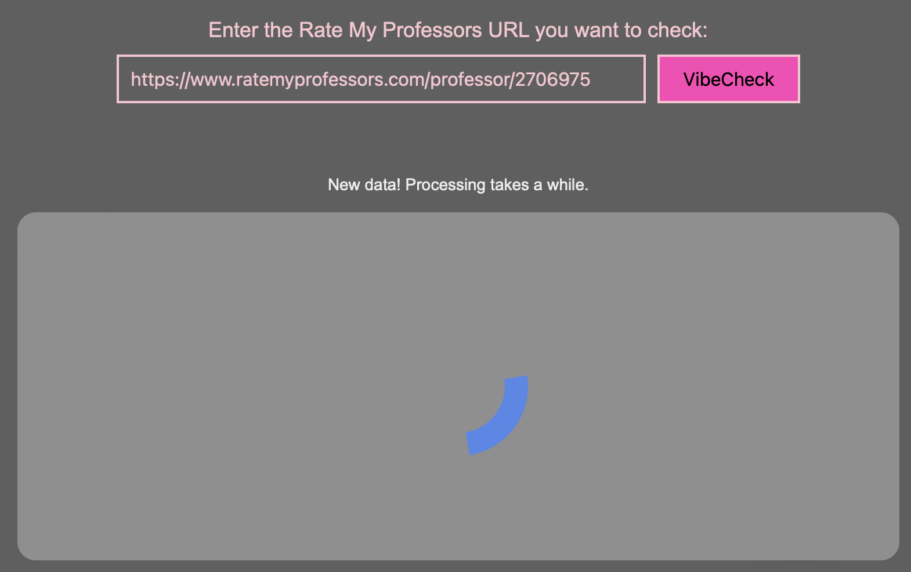

<h2 align="center">VibeCheckMyProf Guide</h2>

Welcome to the visual guide of the VibeCheckMyProf web application. This guide is designed to help you navigate the different components of our final project, ensuring you can effectively utilize it.

## WebPage Overview

- Upon loading VibeCheckMyProf, you arrive at the main interface, where you see the title, a URL entry box, and a definitions box which provides explanations for the terms helping you interpret the sentiment and ratings data that the application retrieves. Lastly, at the very bottom of the page is the button that is linked to the data visualizations dashboard.

## 1. Entering A rateyprofessors URL

- To begin, paste the RateMyProfessors URL of the professor into the text box and click the button on the right, 'VibeCheck', to submit. 

- Ensure the URL is in the correct format, and a valid link, to avoid errors. Otherwise, you will run into the following message. 

- Once the button has been clicked, if the link has not been entered before, it will not be available in the database and thus, will take some time to run sentiment analysis on. Therefore, a status message will be displayed to let you know your request is in process. 

- If you try to request data for the same professor too soon after a recent request, a message will let you know the data is still being processed.

- After a couple minutes (for new data) or immediately (for existing data), the professor's results will be displayed on the page. 

## 2. Viewing A Professor's Data

- Once the data has loaded, you will see an overview for the professor's reviews in a black box, and individual course reviews, for every course with reviews available on the RateMyProfessors website, displayed in a pink box. 

- For example, consider the Rrofessor Cinda Heeren at the University of British Columbia with the RateMyProf link: https://www.ratemyprofessors.com/professor/2302527

- The Professor's Name will be displayed in the black box with the top 3 emotions found in the reviews generated with the GoEmotions original model. Below that, the 'Feels' show the sentiments associated with each review and the number indicates the number of reviews with that sentiment which has been generated with Amazon Comprehend. The quality and difficulty ratings are averaged from the ratings available on ratemyprofessors.com. Lastly, the 'Reviews' sections list the Positivity and Subjectivity score from review comments generated with TextBlob and the average percentage of words spelled correctly in review comments generated with pyspellchecker.

- Below, you can view the overview for the available courses the professor has been reviewed on, with emojis representing the emotion generated for each comment left for the Professor on that course. 

## 3. Viewing Original Comments

- To view original comments left on ratemyprofessors.com for the Professor on that course, hover over the emojis. You will then see the original comment, as well as the emotion given to the comment by the emoji. 

Hover: joy             |  Hover: disgust
:-------------------------:|:-------------------------:
  |  

## 4. Understanding Professor Stats

- The definitions section at the bottom of the page explains the terms to help you interpret the displayed data. 

## 5. Viewing Dashboard

- The 'Data Visualizations' button takes you to a dashboard that's been created on Grafana with different visualizations on all the data saved in our database.

- The dashboard consists of 7 different visualizations. 

